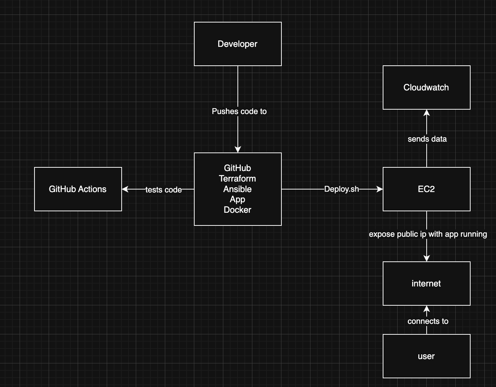

---

## Deployment
Clone the repo  
Ensure you have AWS credentials set up with correct access. to do this you will need to create a terraform.tfvars file in the project root with the following: 

access_key = "your access key"
secret_key = "your secret key"

Make sure the tfvars file is included in .gitignore correctly

next install python terraform and ansible
# System dependencies
sudo apt update && sudo apt install -y \
    git unzip python3 python3-pip \
    software-properties-common sshpass curl gnupg

# Terraform
curl -fsSL https://apt.releases.hashicorp.com/gpg | sudo gpg --dearmor -o /usr/share/keyrings/hashicorp-archive-keyring.gpg

echo "deb [signed-by=/usr/share/keyrings/hashicorp-archive-keyring.gpg] https://apt.releases.hashicorp.com $(lsb_release -cs) main" | \
    sudo tee /etc/apt/sources.list.d/hashicorp.list
sudo apt update && sudo apt install terraform -y

# Ansible
sudo apt-add-repository --yes --update ppa:ansible/ansible
sudo apt install ansible -y

ensure the following are installed
also ensure docker/compose is installed
# Install Docker
curl -fsSL https://get.docker.com | sudo bash

# Enable and start Docker
sudo systemctl enable docker
sudo systemctl start docker

# Install Docker Compose (v2)
sudo apt install docker-compose-plugin -y

pip install -r requirements.txt

push any change to GitHub to run the pipeline tests

Run the deployment script:

```bash
chmod +x deploy.sh
./deploy.sh
```
This will create the necessary infrastruce and configure it with ansible the app should then be accessible on the public ip

